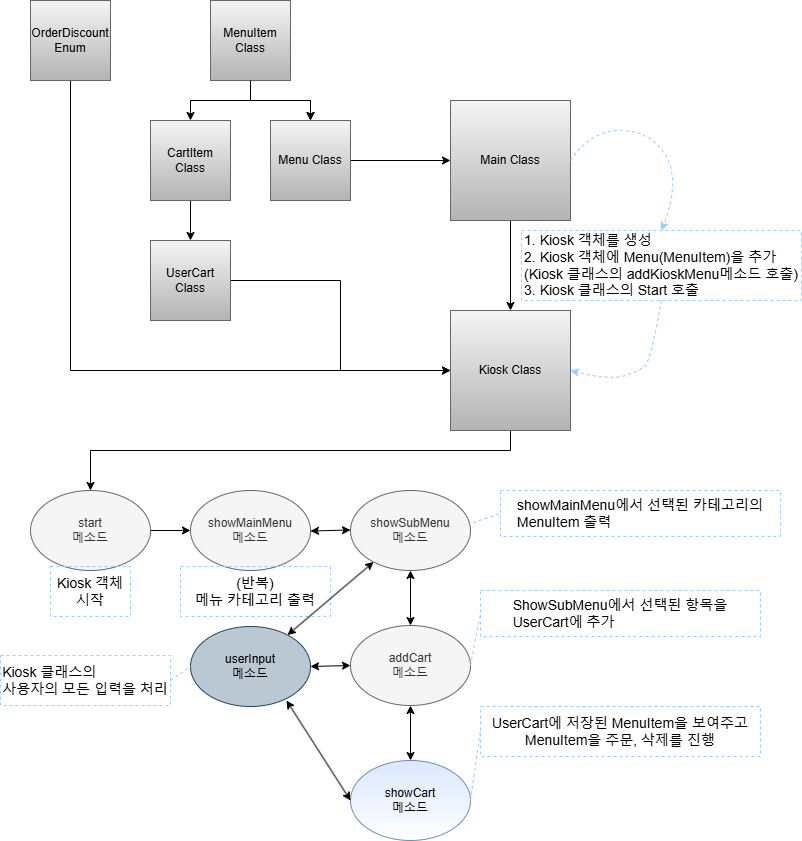

### [ 키오스크 프로젝트 ]

## 요구사항 및 평가 기준

### 완성도

**필수**  
Lv 1. 기본적인 키오스크 프로그래밍
- ✅ 기본적인 키오스크 프로그래밍 (Scanner를 활용한 입력, 반복문과 조건문을 활용한 입력 처리)

Lv 2. 객체 지향 설계를 적용해 햄버거 메뉴를 클래스로 관리
- ✅ 객체 지향 설계를 적용한 햄버거 메뉴의 클래스 관리(클래스에 요구사항에 따른 필드값이 존재하는가, List와 new 키워드를 활용했는가)

Lv 3. 객체 지향 설계를 적용해 순서 제어를 클래스로 관리
- ✅ 객체 지향 설계를 적용한 순서 제어의 클래스 관리(Kiosk 클래스 생성 및 활용, start 메서드 활용한 입/출력 및 종료 흐름 처리)

Lv 4. 객체 지향 설계를 적용해 음식 메뉴와 주문 내역을 클래스
기반으로 관리
- ✅ 객체 지향 설계를 적용한 음식 메뉴와 주문 내역의 클래스 기반 관리(Menu 클래스를 활용한 메뉴 카테고리 관리 및 MenuItem 리스트 포함 여부, 메뉴 카테고리 이름을 반환하는 메서드 구현 여부 )

Lv 5. 캡슐화 적용
- ✅ 캡슐화 적용(접근 제한자 활용, Getter/Setter를 활용해 데이터에 접근 여부)

- - -

**도전**  
Lv 1. 장바구니 및 구매하기 기능 추가
- ✅ 장바구니 및 구매하기 기능 추가(장바구니 기능 추가 여부, 주문 흐름이 동작하는가, 잘못된 입력값에 대한 예외처리 여부)

Lv 2. Enum, 람다 & 스트림을 활용한 주문 및 장바구니 관리
- ✅ Lv 2. Enum, 람다 & 스트림을 활용한 주문 및 장바구니 관리(Enum을 활용한 사용자 유형별 할인율 관리 여부, 람다/스트림을 활용한 장바구니 조회 기능 여부)

- - -

### 이해도

- ✅ TIL에 트러블슈팅 과정을 기록했는가? (과제 제출란에 TIL 링크 제출)
- ✅ 디렉토리 및 파일 분리가 그 쓰임에 따라 명확한가?
- ✅ 변수명 등 코드가 직관적이고 이해하기 쉽게 작성되어 있는가?
- ✅ 주석을 활용해 코드를 설명하였는가?

- - -

### 우수성

- ✅ 구현한 사항에 대해 ReadMe를 작성해 정리했다.
- ✅ 특수 상황에 대한 예외 처리가 2가지 이상 구현되어 있다.
- ✅ 컨벤션을 지킨 커밋 횟수가 10회 이상이다.

## 개발 환경
> IDE : IntelliJ IDEA Community Edition  
> JDK : OpenJDK 17  
> 버전 관리 : Git (GitHub 사용)

## 디렉토리 구조

src
- kiosk
    - Lv1 ...
    - Lv2 ...
    - Lv3 ...
    - Lv5 ...
- kioskChallenge
    - Lv1 ...
    - Lv2
        - cart
            - CartItem.java
            - UserCart.java
        - menu
            - Menu.java
            - MenuItem.java
        - Kiosk.java
        - Main.java
        - OrderDiscount.java

- - -


## 주요 기능 구현

**시스템 동작 흐름**




<details>

<summary style="font-size: 16px;">
<strong> Kiosk Class </strong>
</summary>

### Kiosk Class 메소드 목록

`addKioskMenu(Menu menu)`
- `Main`에서 `Kiosk` 클래스에 `MenuItem`을 추가할 때 사용

`showMainMenu()`
- `Kiosk`클래스에서 처음 프로그램이 실행될 때 `Main`에서 추가한 `MenuItem`의 `Category`목록을 출력

`showSubMenu(int menuChoose)`
- `Category`목록에서 특정 메뉴(햄버거, 음료 등)를 입력했을 때 나오는 해당 `Category`에 속한 메뉴 목록

`userInput(int maxSize, boolean canReturn)`
- 예외처리가 포함된 사용자의 입력을 받고 입력받은 값을 `Return`하는 메소드

`addCart(MenuItem menuItem)`
- `UserCart` 클래스에 사용자가 장바구니에 담은 `MenuItem`을 저장하는 메소드

`showCart()`
- 현재 `UserCart`에 어떤 `MenuItem`이 있는지 보여주는 메소드

`start()`
- `Main`클래스 에서 `MenuItem`을 전달받은 후 `Kiosk`클래스를 실행하는 메소드

- - -

### 주요 기능 `Kiosk (Class) - userInput`
메뉴선택을 위한 입력이 반복되는 만큼, 메소드화 및 예외처리가 필수적이었다.

여러 상황에서 사용할 수 있게 만들어야 하므로, 몇가지 옵션이 필요했다.

1. 메뉴 선택상황
- `0` 을 입력하여 뒤로가기 있는 상황, 선택지에 0이 없는 상황 : `canReturn` 으로 구분
- 1 부터 메뉴갯수까지 입력값을 제한하는 변수 `maxSize`
- 그외 예외처리

2. userInput 메소드
```java
public int userInput(int maxSize, boolean canReturn) {

int inputNum;

while (true) {
    try {
        System.out.print("메뉴 선택: ");
        inputNum = Integer.parseInt(scanner.nextLine().trim());

        if (inputNum == 0 && canReturn == true) {
            return -1;
        }
        else if(inputNum == 0 && canReturn == false)
        {
            System.out.println("입력값의 범위를 벗어났습니다. 다시 입력해주세요.");
        }
        else if (inputNum > 0 && inputNum <= maxSize) {
            return inputNum;
        }
        else {
            System.out.println("입력값의 범위를 벗어났습니다. 다시 입력해주세요.");
        }
    } catch (NumberFormatException e) {
        System.out.println("숫자를 입력해주세요.");
    }
}
}
```
- 해당 메소드의 구현으로 `Kiosk`클래스 내에서 일어나는 모든 입력을 예외 처리 후 사용 할 수 있게 되었다.

</details>


<details>

<summary style="font-size: 16px;">
<strong> OrderDiscount Enum </strong>
</summary>

### OrderDiscount Enum  메소드 목록

`getDiscountPercent`
- `Enum`내에 설정된 할인율을 반환하는 메소드

`doDiscount(int userOption, double totalPrice)` 메소드
- 사용자의 선택에 따른 할인율을 적용
- userOption 값을 기반으로 해당하는 OrderDiscount Enum을 선택
- 할인 금액과 최종 결제 금액을 소수점 두 자리까지 반올림하여 처리
- 선택된 할인율로 할인 금액을 계산 후 할인 금액을 출력, 최종 결제 금액을 반환


### 주요 기능 `OrderDiscount (Enum) - doDiscount`

Lv2의 요구사항에 맞게 할인 적용 기능을 제공하는 메소드를 `Enum`을 활용하여 사용자 유형별 할인율을 적용했다.  
사용자의 선택한 할인유형에 따라 서로 다른 할인율이 적용되고, 할인율을 출력한 뒤 최종 결제 금액을 계산하고 반환하는 기능을 수행한다.

1. `Kiosk` 클래스에서 (예시)`할인율계산(값)` 처럼 사용을 간단하게 한줄로 실행 하고싶었다.

2. Enum 구조 및 메소드
```java
    //Enum(OrderDiscount)
    // HERO(0.10),
    // SOLDIER(0.05),
    // STUDENT(0.03),
    // PERSON(0.00);

public static double doDiscount(int userOption, double totalPrice) {
    OrderDiscount discountType = null;

    switch (userOption) {
        case 1: discountType = HERO;
            break;
        case 2: discountType = SOLDIER;
            break;
        case 3: discountType = STUDENT;
            break;
        case 4: discountType = PERSON;
            break;
    }

    double discountPrice = Math.floor(totalPrice * discountType.getDiscountPercent() * 100) / 100;
    totalPrice = Math.floor((totalPrice - discountPrice) * 100) / 100;

    System.out.println("할인금액 ￦ " + discountPrice);
    return totalPrice;
}
```
`Kiosk` 클래스에서는 선택한 할인유형을 `userOption`으로, 할인 전 금액을 `TotalPrice`로 전달한다.  
`totalPrice = OrderDiscount.doDiscount(userOption, totalPrice);`  
이제 `Kiosk` 클래스에서는 간단하게 한줄로 `Enum`을 이용한 할인 금액 계산이 가능해졌다.

</details>


## 트러블 슈팅 및 예외처리

<details>
<summary style="font-size: 16px;">
<strong> 1. Lv2 요구사항에 따른 lambda&Stream 활용 장바구니 삭제 기능 </strong>  
</summary>

**요구사항**

1. 기존에 생성한 Menu의 MenuItem을 조회 할 때 스트림을 사용하여 출력하도록 수정
2. 기존 장바구니에서 특정 메뉴 빼기 기능을 통한 스트림 활용

- - -

처음부터 `lambda&Stream`을 활용한 장바구니 관련 기능을 만들겠다는 계획을 가지고 시작했다면 `Kiosk` 클래스를 좀 더 알맞게 작업할 수 있었을 것같다.  
장바구니에서 특정 메뉴 삭제의 경우 비교적 간단하게 리팩토링 할 수있었다.  
기존에는 `Kiosk`의 `userInput` 메소드를 이용하여, `UserCart`클래스에서 장바구니를 삭제하는 메소드(`For`문 사용)를 호출했었는데  
`lambda&Stream` 을 이용하여 `for`문이 아닌 새로운 리스트 생성하여 `cartItems` 변수에 저장했다.


```java
public void removeItem(String itemName) { // For 문 이용
    for (int i = 0; i < cartItems.size(); i++) {
        if (cartItems.get(i).getCartItemName().equals(itemName)) {
            cartItems.remove(i);
            System.out.println(itemName + " 메뉴가 삭제되었습니다.");
        }
    }
}

```
- 기존의 For문을 이용하여 삭제하는 코드

```java
public void removeItem(String itemName){  //Stream 이용
    cartItems = cartItems.stream()
            .filter(cartItem -> !cartItem.getCartItemName().equals(itemName))
            .collect(Collectors.toList());
    System.out.println(itemName + " 메뉴가 삭제되었습니다.");
}
```
- 변경된 Stream을 이용하여 삭제하는 코드

문제가 되었던 부분은 **기존에 생성한 Menu의 MenuItem을 조회 할 때 스트림을 사용하여 출력하도록 수정**이었는데,  
기존의 `Menu`클래스의 `MenuItem`을 조회하는 부분은 다음과 같다.
```java
// Menu.java
public List<MenuItem> getMenuItems(){
    return menuItems;
}
```

```java
// Kiosk.java
    public void showSubMenu(int menuChoose){
        List<MenuItem> itemList = menus.get(menuChoose).getMenuItems();
        for (int i=0; i<itemList.size(); i++)
       {
           System.out.println(i + 1 + ". " + itemList.get(i).getMenuFullName());
       }
        System.out.println("0. 뒤로가기");
    ... 생략}
```

- 단순히 `private List<MenuItem> menuItems` 로 선언된 `menuItems`를 리턴해주고, 이를 `Kiosk` 클래스에서 출력하는것으로 처리했었다.

이 방법의 장점은 인덱스 설정이 편리했었다는 것이다.  
사용자의 `Menu Category` 선택 후 `menuChoose` 변수로 `menus` 중 해당하는 `menu`로 접근하여 인덱스, 메뉴이름을 출력했었는데 `Stream`에서 인덱스를 사용하는 방법에 대해서는 몰랐었기에 ~~메뉴를 한글로 받아버려야하나?~~ 등의 ... 생각을 했었고, `menuItems.stream()`을 입력하고 . 을 찍고 내리다보니 `forEach`라는 글자가 보였다! `Stream`에서 인덱스를 활용할 수 있는 방법이 분명히 있을 터 검색을 했고, 여러가지 방법이 존재했다.

1. `AtomicInteger` 활용
- 변경 가능한(mutable) 정수를 제공하는 클래스로 `forEach` 내부에서 `AtomicInteger`의 메소드로 값을 증가시킬 수 있다.

2. `IntStream.range(start, end)` 활용
- 특정 범위의 정수를 생성하는 메서드로 `.forEach(i -> System.out.println(i))` 값이 start 부터 end 까지 증가한다.

나의 경우에는 1번 `AtomicInteger`를 사용했다.  
`IntStream.range()`는 **숫자 범위를 생성하는 스트림**, 정수 스트림, Index 관련 예외처리( `IndexOutOfBoundsException` )가 필요할 수 있음  
`menuItems.stream()`은 **리스트 요소 자체를 스트림으로 변환**, 객체 스트림, 인덱스 필요 시 추가 작업 필요  
많이 보았던 `.stream()` 이 익숙하기도 하고, `IntStream`에 대해 알고있지 않았기에 `.stream`으로 작성을 했다.

```java
public void printMenuItems(){
        AtomicInteger index = new AtomicInteger(1);     //초기화
        menuItems.stream()
                .forEach(menuItem ->
                        {
                            int itemIndex = index.getAndIncrement();    //index의 값을 증가, itemIndex에 값을 대입
                            System.out.println(itemIndex + ". " + menuItem.getMenuFullName());  //itemIndex로 값을 출력
                        }
                );
    }
```

정상적으로 출력이 된다!  
... 후에 2번으로도 구현은 해보았다.

```java
public void printMenuItems() {
    IntStream.range(0, menuItems.size())  // 0부터 menuItems.size() - 1까지
            .forEach(i -> 
                System.out.println((i + 1) + ". " + menuItems.get(i).getMenuFullName()) // 1부터 시작
            );
}
```
2번인 `IntStream`이 Index를 활용해야하는 경우에는 보다 더 적절해보이는 느낌이 들었다... 다음에는 처음보는 메소드, 키워드여도 잘 알아보고 더 적절하고 효율적인 방식을 채택하는게 필요하다는걸 느꼈다...

결국 2번 `IntStream`을 활용했다.

</details>


<details>

<summary style="font-size: 16px;">
<strong> 2. 반복되는 scanner 사용 및 예외처리를 메소드화 </strong>  
</summary>

**요구사항**

없음

- - -

내가 필요에 의해 작성한 메소드이다.

메인메뉴 출력 -> (입력) -> 서브메뉴 출력 -> (입력) -> 장바구니 담을지 의사결정 -> (입력) -> 장바구니에 담은 메뉴가 있다면 주문 활성화
주문 -> (입력) -> 장바구니 메뉴 출력, 주문 의사결정 -> (입력) -> 주문 시 할인여부, 삭제 시 삭제할 메뉴 인덱스 입력

입력을 받는 부분이 최소 5개 이상이었고, 매번 `Scanner`로 입력을 받고, 예외처리를 진행한다면 코드가 불필요하게 너무 길어진다고 느꼈다.  
그에따라 사용자에게 일정 길이의 메뉴를 출력해주고, 해당 길이 안에서 입력을 받고 예외처리를 진행하는 메소드를 작성했다.

이미 주요기능에 `userInput`에 대해 작성했지만, 처음에는 문제가 있었다.

```java
// 처음 작성했던 userInput
public int userInput(int maxSize) {

    int inputNum;

    while (true) {
        try {
            System.out.print("메뉴 선택: ");
            inputNum = Integer.parseInt(scanner.nextLine().trim()); // 문자열 입력 방지

            if (inputNum == 0) {
                return -1;
            }
            else if (inputNum > 0 && inputNum <= maxSize) {
                return inputNum;
            }
            else {
                System.out.println("입력값의 범위를 벗어났습니다. 다시 입력해주세요.");
            }
        } catch (NumberFormatException e) {
            System.out.println("숫자를 입력해주세요.");
        }
    }
}
```

1. 일부 상황에서는 0을 입력할 수 있기 때문에 (메인메뉴의 종료, 메인메뉴에서 선택 후 뒤로가기) 해당 입력에서는 0이 입력 가능
2. 0에 대한 예외처리가 되지 않은 입력에서는 -1를 반환하여 프로그램이 예외(인덱스 없음)를 인지하지 못하고 종료되는 현상 방지

`boolean` 형으로 `canReturn`이라는 변수를 받게 했다.  
0입력을 사용하는 경우 `userInput(메뉴갯수,true)` -> 0 입력시 -1 반환  
0입력을 사용하지 않는 경우 `userInput(메뉴갯수,false)` -> 0 입력시 안내와 함께 `continue`

```java
public int userInput(int maxSize, boolean canReturn) {

    int inputNum;

    while (true) {
        try {
            System.out.print("메뉴 선택: ");
            inputNum = Integer.parseInt(scanner.nextLine().trim()); // 문자열 입력 방지

            if (inputNum == 0 && canReturn == true) {
                return -1;
            }
            else if(inputNum == 0 && canReturn == false)
            {
                System.out.println("입력값의 범위를 벗어났습니다. 다시 입력해주세요.");
            }
            else if (inputNum > 0 && inputNum <= maxSize) {
                return inputNum;
            }
            else {
                System.out.println("입력값의 범위를 벗어났습니다. 다시 입력해주세요.");
            }
        } catch (NumberFormatException e) {
            System.out.println("숫자를 입력해주세요.");
        }
    }
}
```

해당 메소드를 사용함에 따라 기존에는 try-catch문이 모든 scanner 에 함께했었는데, 완벽하게 벗어날 수 있었고  
평가항목인 특수상황에 따른 예외처리 2가지 이상 구현은 ... 애매해졌다!  
항상 입력값의 범위를 설정하고, 그 이외의 값은 예외처리를 진행하여 재 입력을 받기 때문에 `userInput`의 예외처리 외에는 예외처리가 존재하지 않는다.
</details>

## 아쉬운 점
1. 전체적인 설계가 아쉽다.
    - 조금 더 잘 분리해서 깔끔한 코드를 작성할 수 있었을텐데 복잡해보이고 읽기 어려워보인다.
    - 먼저 기능을 확실히 구현한 뒤 계속해서 구조를 변경하고, 메소드화하는 리팩토링을 거쳤지만 전체적으로 읽기 어려워보인..다..